Cellit client
=============
### The related program

:chart_with_upwards_trend: Api-server : [Cellit Api-server](https://github.com/chl8263/Cellit-api-server)

:rocket: Purpose of program
-------------
'Cellit' is Abbreviation of 'cell unit'.

__The Cellit concepts__ is Cell provide individual space and guarantee communication for joined each user.

Manager of cell can manage about channel and users. Forexample reject for requested join specific cell or terminate user and channel.

Release 1.0 version is focus on overall structure.

:factory: Program structure
-------------

### Technology set

|Technical Name|Value|
|:---:|:---:|
|Language|[Javascript es6](https://javascript.info/)|
|Framework|[React](https://reactjs.org/)|
|State Management|[Redux](https://github.com/reduxjs/redux)|
|Ui Framework|[Bootstrap](https://getbootstrap.com/)|
 

In order to request Api on client need to put JWT token on 'Authorization' of http header.
__Client get JWT token at login and save JWT state at REDUX.__

 

### Response as HAL - Hypertext Application Language

Every response of request has body based on `HAL - Hypertext Application Language`.
So this client active use of HAL link provided by server.
~~~
{
    "_embedded": {
        "channelPostEntityModelList": [
            {
                "channelPostId": 3,
                "channelPostName": "test2",
                "accountId": 1,
                "accountName": "ewan",
                "viewCount": 0,
                "createDate": "2020-12-10.03:55:01",
                "modifyDate": "2020-12-10.03:55:01",
                "active": 1,
                "_links": {
                    "self": {
                        "href": "http://localhost:8081/api/channels/1/channelPosts/3"
                    }
                }
            },
            {
                "channelPostId": 2,
                "channelPostName": "test2",
                "accountId": 1,
                "accountName": "ewan",
                "viewCount": 0,
                "createDate": "2020-12-10.02:49:43",
                "modifyDate": "2020-12-10.02:49:43",
                "active": 1,
                "_links": {
                    "self": {
                        "href": "http://localhost:8081/api/channels/1/channelPosts/2"
                    }
                }
            },
        ]
    },
    "_links": {
        "self": {
            "href": "http://localhost:8081/api/channels/1/channelPosts?postNameToSearch=&page=0&size=10&sort=createDate,desc"
        }
    },
    "page": {
        "size": 10,
        "totalElements": 3,
        "totalPages": 1,
        "number": 0
    }
}
~~~

 

:hammer: Working with Cellit in your IDE
-------------

### Prerequisites

The following items should be installed in your setting:

* [Node.js](https://nodejs.org/en/)
* [Git](https://git-scm.com/)
* Your preferred IDE
    * [VS Code](https://code.visualstudio.com/)

### Steps:
1. On the command line
    ~~~
    https://github.com/chl8263/Cellit-client.git
    ~~~

2. Open Terminal on the directory and put The code below in order.
    ~~~shell
    npm run build

    npm install
    ~~~
3. Run this project.
    ~~~shell
    npm run dev
    ~~~

 

:computer: UI Function
-------------

### Signup

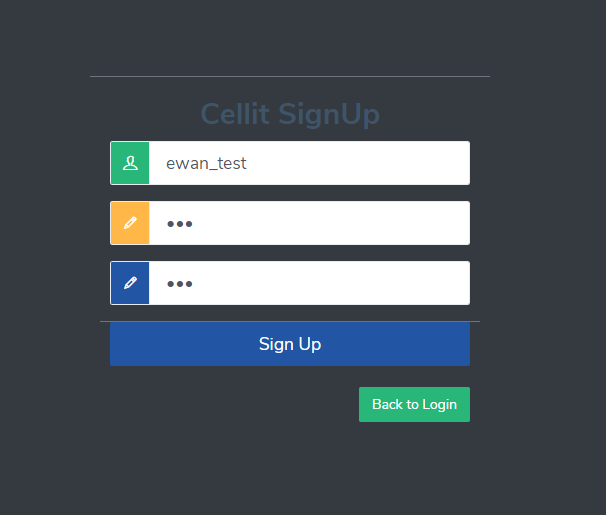

### Login

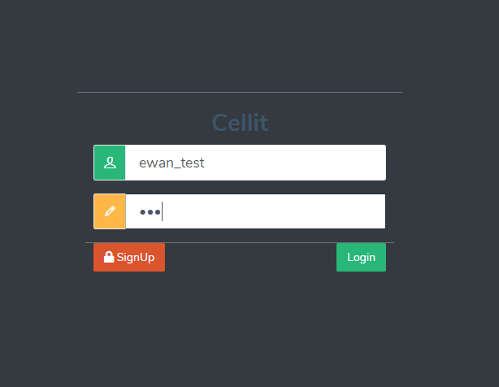

~~~
Client request JWT Token about specific account and try to login to Api server
~~~

### Mainboard

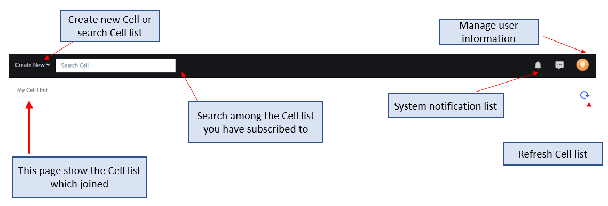

### create_new

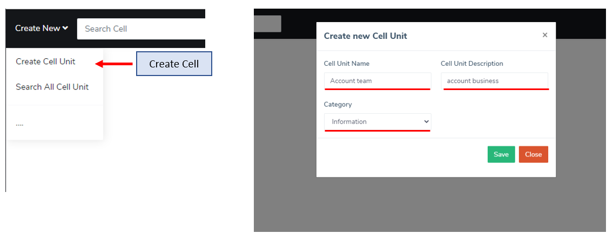

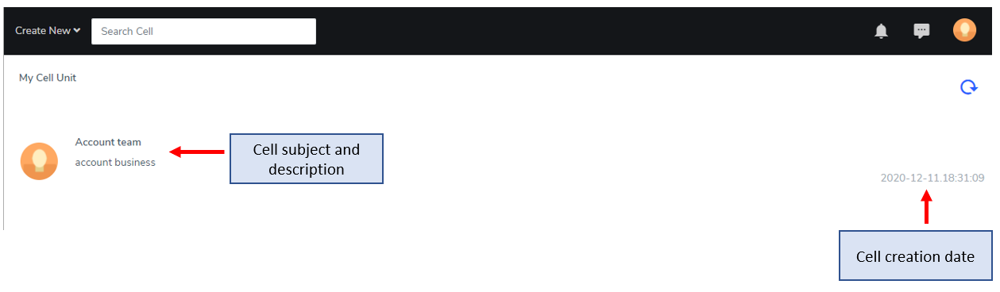

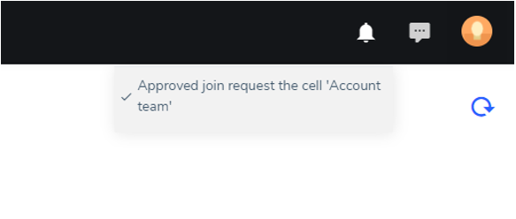

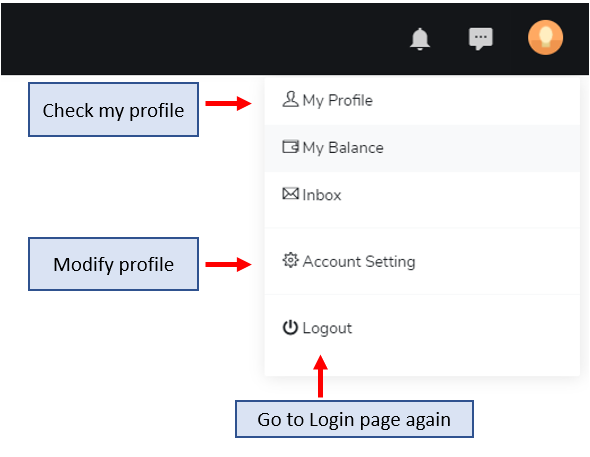

### search_cell

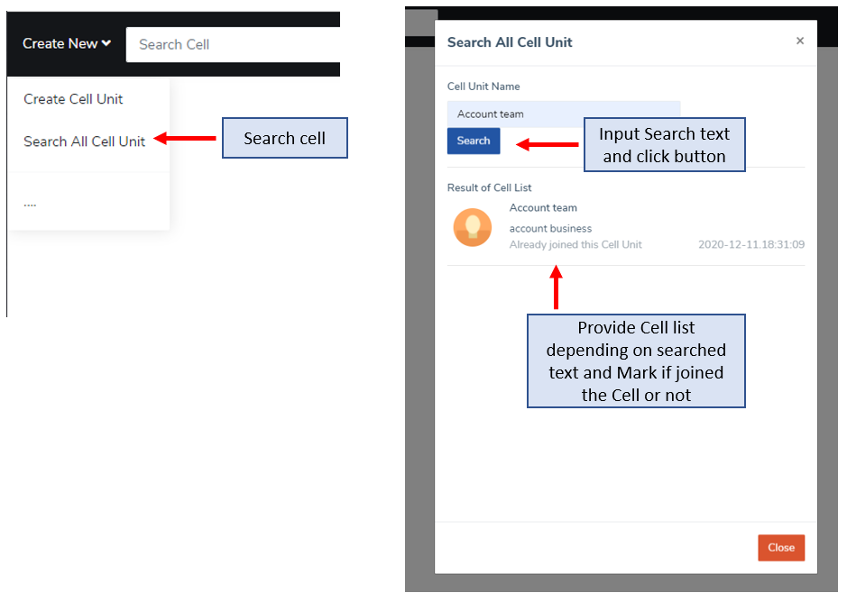

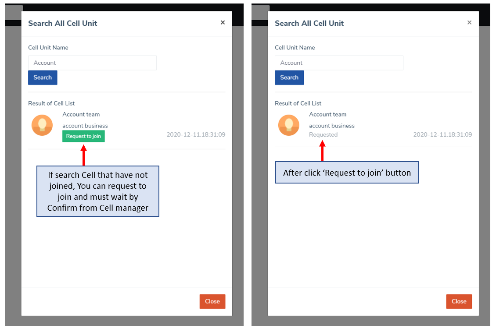

### cell_unit

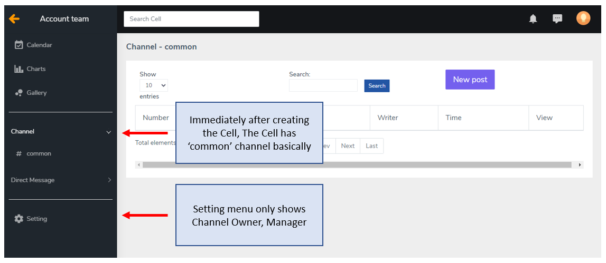

### channel

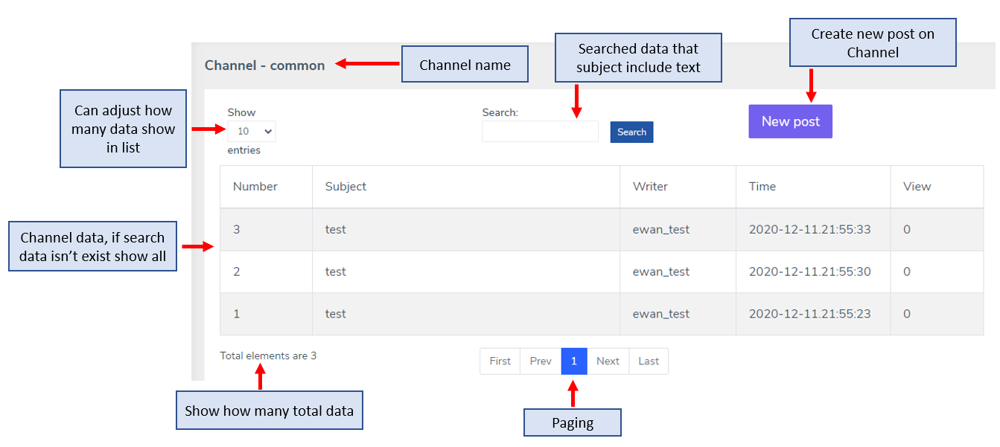

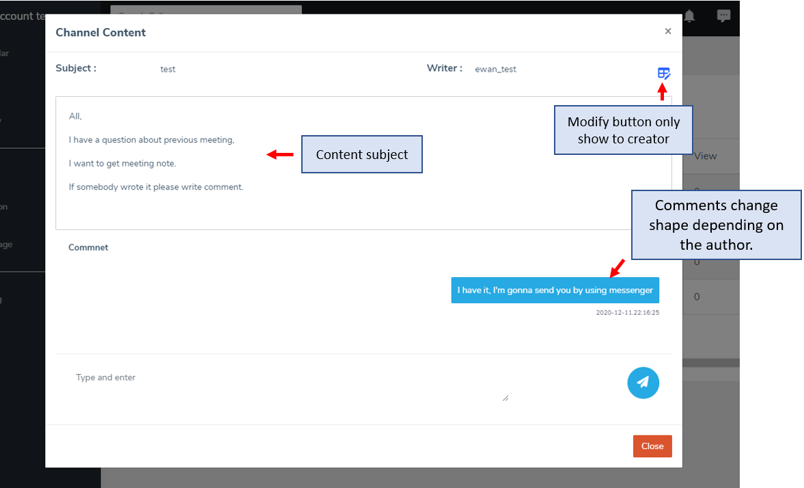

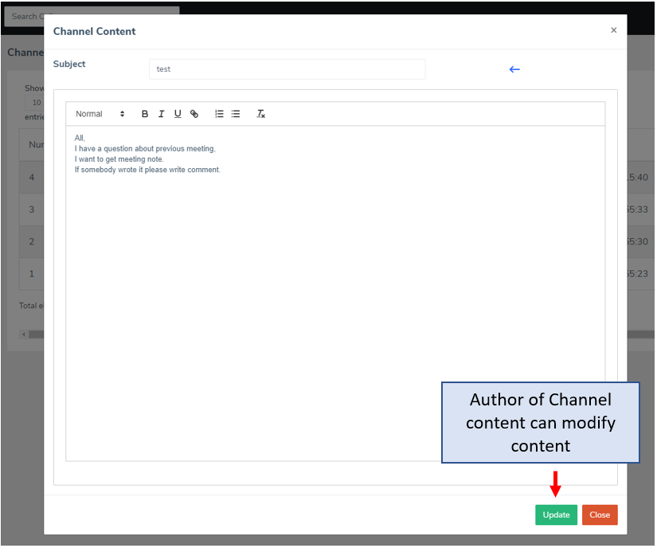

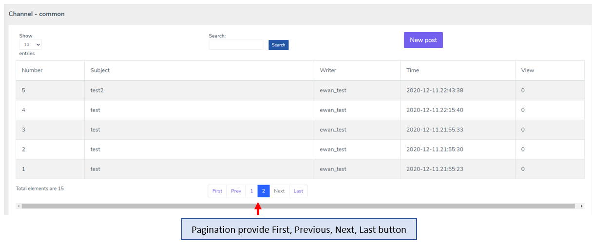

### channel

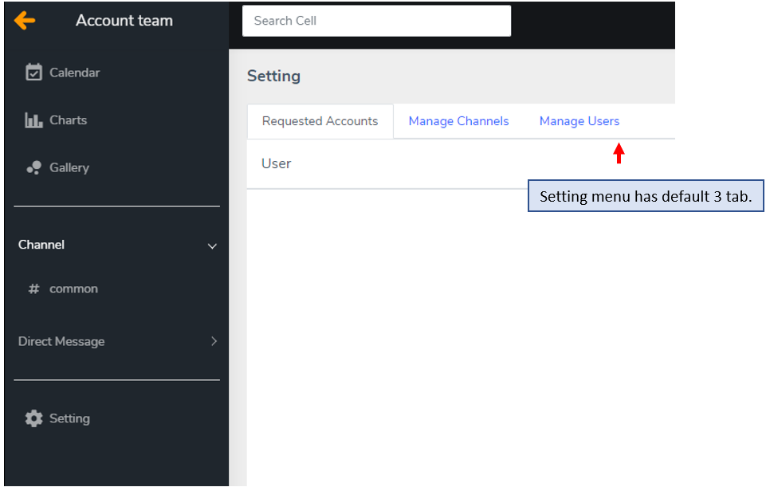

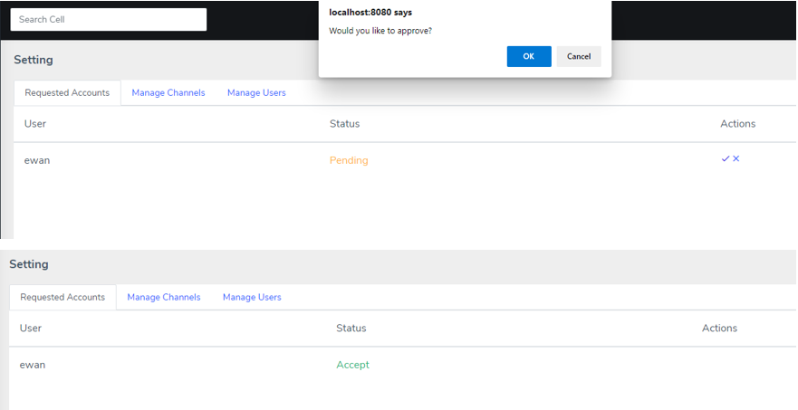

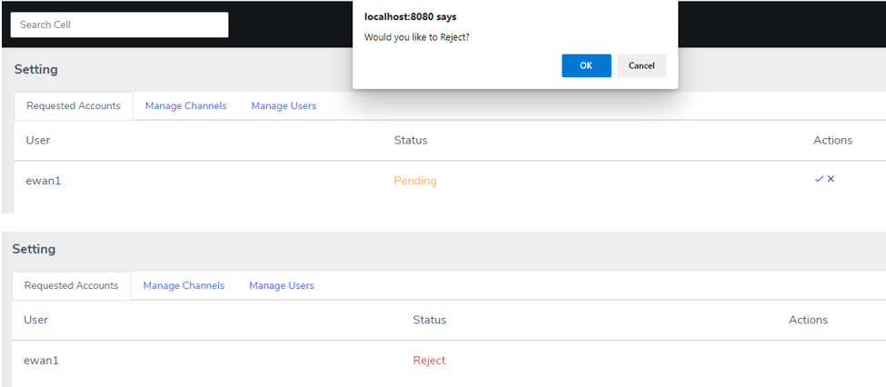

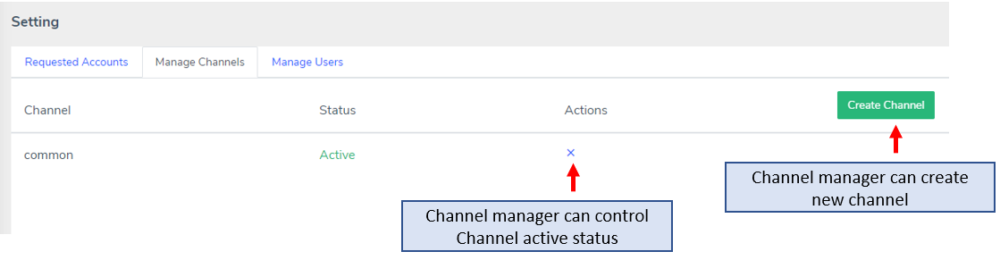

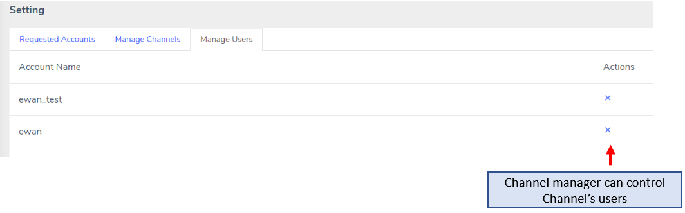

